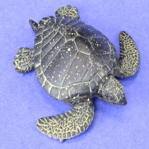
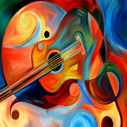
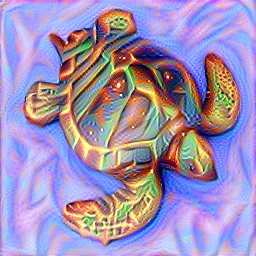
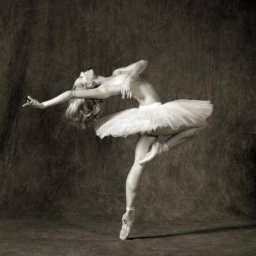
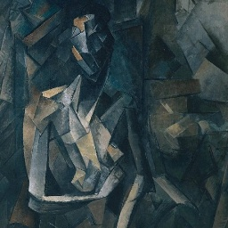
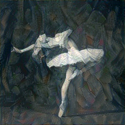

# NeuralStyleTensorflow

## Neural Style algorthim, as introduced in ["A Neural Algorithm of Artistic Style"](https://arxiv.org/abs/1508.06576), implemented in tensorflow

## Examples:
| Input/Content image | Style Image | Mixed |
| :---:         |     :---:      |          :---: |
|   |     |     |
|       |         |        |

## How to use:
#### Installation:
		pip install -r requirements.txt

#### Stylize an input image:
		python neural_style.py [input image path] [content image path] [style image path] [size of images] [epochs] [output filename]

#### Stylize a white noise image:
		python neural_style.py "white" [content image path] [style image path] [size of images] [epochs] [output filename]
